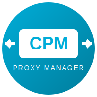

# CPM - Caddy Proxy Manager

<p align="center">
  
</p>

<p align="center">
  <strong>🚀 v3.0.0 - Complete Go Rewrite!</strong><br>
  Lightweight web UI for managing Caddy reverse proxy
</p>

<p align="center">
  
  
  
  
</p>

---

## 🆕 What's New in v3.0.0

### Complete Rewrite in Go
- **From Python to Go** - Faster, lighter, more efficient
- **~25MB Docker image** - Down from 800MB in v2.x!
- **Single binary** - No dependencies, instant startup
- **Modern UI** - Fresh, clean design with improved UX

### Key Improvements
- ⚡ **Lightning fast** - Go performance + Fiber framework
- 🎨 **New modern UI** - Redesigned forms and layouts
- 🔐 **Persistent auth** - User sessions survive restarts
- 🐳 **Docker native** - Built for containerized environments
- 🔄 **Live reload** - Instant Caddy configuration updates

---

## ✨ Features

| Feature | Description |
|---------|-------------|
| 📊 **Dashboard** | System overview, stats, alerts, quick actions |
| 🔀 **Proxy Rules** | Visual editor for reverse proxy rules |
| ⚙️ **Snippets** | Cloudflare DNS, security headers, rate limiting |
| 📜 **Certificates** | SSL overview with expiration warnings |
| 👥 **Multi-User** | Role-based access (Admin, Editor, Viewer) |
| 💾 **Backup** | Full config backup & restore |
| 🌐 **i18n** | English & Czech |
| 📋 **Templates** | 17+ pre-configured service templates |

---

## 🚀 Quick Start

### Docker Hub

```bash
docker pull perteus/cpm:latest
docker pull perteus/cpm:3.0.0
```

### Docker Compose (Recommended)

```yaml
version: '3.8'

services:
  caddy:
    image: caddy:2-alpine
    container_name: caddy_proxy
    ports:
      - "80:80"
      - "443:443"
    volumes:
      - ./caddy-config:/etc/caddy
      - ./caddy-data:/data

  cpm:
    image: perteus/cpm:3.0.0
    container_name: cpm
    ports:
      - "8501:8501"
    environment:
      - CONTAINER_NAME=caddy_proxy
      - DEFAULT_IP=192.168.1.100
    volumes:
      - ./caddy-config:/caddy-config
      - ./caddy-data:/caddy-data
      - /var/run/docker.sock:/var/run/docker.sock
```

### With Cloudflare DNS Challenge

```yaml
services:
  caddy:
    image: serfriz/caddy-cloudflare:latest
    container_name: caddy_proxy
    environment:
      - CF_API_TOKEN=${CF_API_TOKEN}
    volumes:
      - ./caddy-config:/etc/caddy
      - ./caddy-data:/data

  cpm:
    image: perteus/cpm:3.0.0
    container_name: cpm
    privileged: true  # Required for Synology
    ports:
      - "8501:8501"
    environment:
      - CONTAINER_NAME=caddy_proxy
      - DEFAULT_IP=192.168.1.100
    volumes:
      - ./caddy-config:/caddy-config
      - ./caddy-data:/caddy-data
      - /var/run/docker.sock:/var/run/docker.sock
```

---

## ⚙️ Environment Variables

| Variable | Description | Default |
|----------|-------------|---------|
| `PORT` | HTTP port | `8501` |
| `CONTAINER_NAME` | Caddy container name | `caddy` |
| `CADDY_CONFIG_PATH` | Path to Caddy config | `/caddy-config` |
| `CADDY_DATA_PATH` | Path to Caddy data | `/caddy-data` |
| `DEFAULT_IP` | Default target IP for new rules | `192.168.1.1` |

---

## 📁 Folder Structure

```
caddy-config/
├── Caddyfile              # Main Caddy configuration
├── snippets.caddy         # Shared snippets (auto-generated)
├── sites/                 # Proxy rules (one file per domain)
│   ├── example.com.caddy
│   └── app.example.com.caddy
└── pages/                 # Custom error pages (optional)
    ├── 403.html
    └── 404.html

caddy-data/
└── caddy/
    └── certificates/      # SSL certificates (auto-managed)
```

---

## 🖼️ Screenshots

### Dashboard
- System stats and certificate alerts
- Quick actions (Reload, Validate, Backup)
- Recent changes overview

### Proxy Rules
- Clean form-based editor
- Snippet selection as pills
- Advanced options in collapsible section

### Login
- Modern centered login page
- First-run admin setup

---

## 🔧 Synology NAS Setup

For Synology Docker, use `privileged: true` to allow Docker socket access:

```yaml
cpm:
  image: perteus/cpm:3.0.0
  privileged: true
  volumes:
    - /volume1/docker/caddy-config:/caddy-config
    - /volume1/docker/caddy-data:/caddy-data
    - /var/run/docker.sock:/var/run/docker.sock
```

---

## 📚 API

```bash
GET  /api/v1/sites    # List all proxy rules
GET  /api/v1/status   # Caddy status
POST /api/v1/reload   # Reload Caddy configuration
```

---

## 🏗️ Building from Source

```bash
# Prerequisites: Go 1.22+

git clone https://github.com/TomasZmek/cpm.git
cd cpm

# Build
go build -o cpm ./cmd/cpm

# Run
./cpm
```

### Docker Build

```bash
docker build -t cpm:3.0.0 .
```

---

## 📝 Version History

| Version | Date | Notes |
|---------|------|-------|
| **3.0.0** | 2026-01 | 🎉 Complete Go rewrite, new UI |
| 2.2.1 | 2025-12 | Python version (deprecated) |
| 2.0.0 | 2025-11 | Major Python refactor |
| 1.0.0 | 2025-10 | Initial release |

---

## 🤝 Contributing

Contributions welcome! Feel free to submit issues and pull requests.

- 🐛 **Report bugs**: [GitHub Issues](https://github.com/TomasZmek/cpm/issues)
- 💡 **Feature requests**: [GitHub Discussions](https://github.com/TomasZmek/cpm/discussions)
- 📦 **Source code**: [GitHub Repository](https://github.com/TomasZmek/cpm)

---

## 📄 License

MIT License - see [LICENSE](LICENSE) for details.

---

## 🙏 Acknowledgments

- Built with [Go](https://golang.org/) & [Fiber](https://gofiber.io/)
- Interactivity: [HTMX](https://htmx.org/)
- Developed with assistance from [Claude AI](https://claude.ai)

---

<p align="center">
  <strong>CPM v3.0.0 - Caddy Proxy Manager</strong><br>
  Made with ❤️ for home labs<br>
  <a href="https://hub.docker.com/r/perteus/cpm">Docker Hub</a> •
  <a href="https://github.com/TomasZmek/cpm">GitHub</a>
</p>
