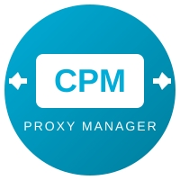
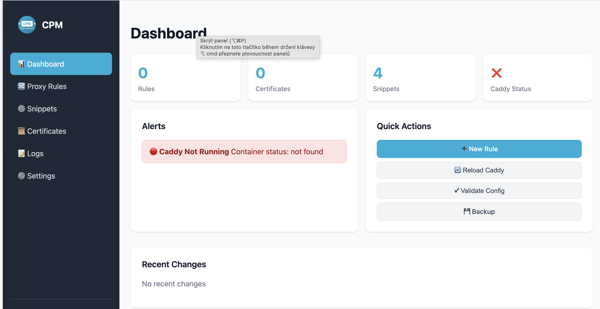
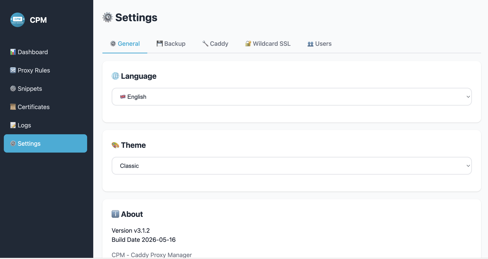
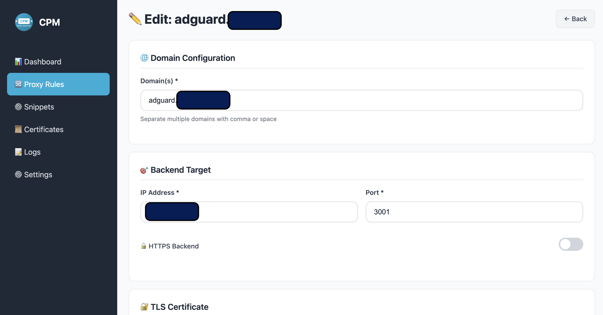
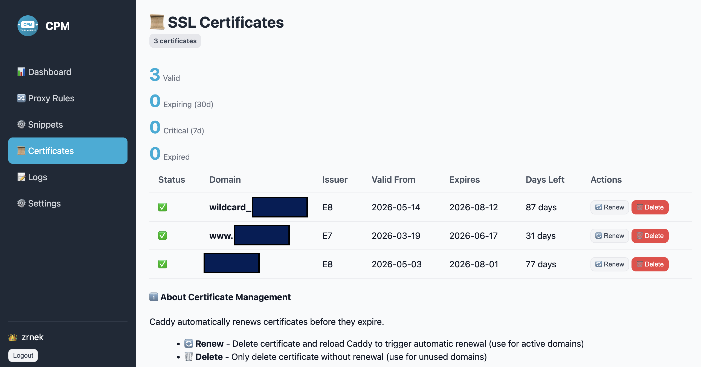

# CPM - Caddy Proxy Manager

<p align="center">
  
</p>

<p align="center">
  <strong>🚀 Lightweight web UI for managing Caddy reverse proxy</strong><br>
  Wildcard SSL • Auto-detection • One-click migration
</p>

<p align="center">
  
  
  
  
  
</p>

---

## 📸 Screenshots

<p align="center">
  
  <br><em>Dashboard — system overview, alerts, quick actions</em>
</p>

<p align="center">
  
  <br><em>Settings — language, theme, wildcard SSL, users</em>
</p>

<p align="center">
  
  <br><em>Proxy Rules — visual editor for reverse proxy configuration</em>
</p>

<p align="center">
  
  <br><em>Certificates — SSL overview with expiration status</em>
</p>

---

## ✨ Features

| Feature | Description |
|---------|-------------|
| 📊 **Dashboard** | System overview, stats, alerts, quick actions |
| 🔀 **Proxy Rules** | Visual editor for reverse proxy rules |
| 🔐 **Wildcard SSL** | Manage wildcard certificates with DNS challenge |
| ⚙️ **Snippets** | Cloudflare DNS, security headers, rate limiting |
| 📜 **Certificates** | SSL overview with expiration warnings |
| 👥 **Multi-User** | Role-based access (Admin, Editor, Viewer) |
| 💾 **Backup** | Full config backup & restore |
| 🌐 **i18n** | English & Czech |
| 📋 **Templates** | 17+ pre-configured service templates |

---

## 🚀 Quick Start

### Docker Hub

```bash
docker pull perteus/caddy-ui:3.1.2
docker pull perteus/caddy-ui:latest
```

### Docker Compose (Recommended)

```yaml
version: '3.8'

services:
  caddy:
    image: caddy:2-alpine
    container_name: caddy_proxy
    ports:
      - "80:80"
      - "443:443"
    volumes:
      - ./caddy-config:/etc/caddy
      - ./caddy-data:/data

  cpm:
    image: perteus/caddy-ui:3.1.2
    container_name: cpm
    ports:
      - "8501:8501"
    environment:
      - CONTAINER_NAME=caddy_proxy
      - DEFAULT_IP=192.168.1.100
    volumes:
      - ./caddy-config:/caddy-config
      - ./caddy-data:/caddy-data
      - /var/run/docker.sock:/var/run/docker.sock
```

### With Cloudflare DNS Challenge (Wildcard SSL)

```yaml
services:
  caddy:
    image: serfriz/caddy-cloudflare:latest
    container_name: caddy_proxy
    environment:
      - CF_API_TOKEN=${CF_API_TOKEN}
    ports:
      - "80:80"
      - "443:443"
    volumes:
      - ./caddy-config:/etc/caddy
      - ./caddy-data:/data

  cpm:
    image: perteus/caddy-ui:3.1.2
    container_name: cpm
    privileged: true  # Required for Synology
    ports:
      - "8501:8501"
    environment:
      - CONTAINER_NAME=caddy_proxy
      - DEFAULT_IP=192.168.1.100
    volumes:
      - ./caddy-config:/caddy-config
      - ./caddy-data:/caddy-data
      - /var/run/docker.sock:/var/run/docker.sock
```

---

## 🔐 Wildcard SSL Setup

1. **Navigate to Settings → Wildcard SSL**
2. **Add your domain** (e.g., `zrnek.cz` for `*.zrnek.cz`)
3. **Select provider** (Cloudflare) and configure API token
4. **Migrate existing sites** - CPM will offer to update all matching sites

When creating new proxy rules, CPM automatically detects if a wildcard certificate is available and pre-selects it.

### How it works

CPM generates TLS snippets in `snippets.caddy`:

```
(wildcard-tls-zrnek-cz) {
    tls {
        dns cloudflare {env.CF_API_TOKEN}
    }
}
```

Sites using wildcard import this snippet:
```
adguard.zrnek.cz {
    import wildcard-tls-zrnek-cz
    import cloudflare_dns
    reverse_proxy 192.168.1.100:3000
}
```

---

## ⚙️ Environment Variables

| Variable | Description | Default |
|----------|-------------|---------|
| `PORT` | HTTP port | `8501` |
| `CONTAINER_NAME` | Caddy container name | `caddy` |
| `CADDY_CONFIG_PATH` | Path to Caddy config | `/caddy-config` |
| `CADDY_DATA_PATH` | Path to Caddy data | `/caddy-data` |
| `DEFAULT_IP` | Default target IP for new rules | `192.168.1.1` |
| `CF_API_TOKEN` | Cloudflare API token (for wildcard SSL) | - |

---

## 📁 Folder Structure

```
caddy-config/
├── Caddyfile              # Main config (managed by CPM)
├── snippets.caddy         # Shared snippets + wildcard TLS (auto-generated)
├── sites/
│   ├── wildcard/          # Wildcard site handle blocks
│   │   └── *.domain.caddy
│   └── standard/          # Standard domain {} blocks
│       └── domain.caddy
└── pages/                 # Custom error pages (optional)
    ├── 403.html
    └── 404.html

caddy-data/
└── caddy/
    └── certificates/      # SSL certificates (auto-managed)
```

---

## 🔧 Synology NAS Setup

For Synology Docker, use `privileged: true` to allow Docker socket access:

```yaml
cpm:
  image: perteus/caddy-ui:3.1.2
  privileged: true
  volumes:
    - /volume1/docker/caddy-config:/caddy-config
    - /volume1/docker/caddy-data:/caddy-data
    - /var/run/docker.sock:/var/run/docker.sock
```

---

## 📚 API

```bash
GET  /api/v1/sites    # List all proxy rules
GET  /api/v1/status   # Caddy status
POST /api/v1/reload   # Reload Caddy configuration
```

---

## 🏗️ Building from Source

```bash
# Prerequisites: Go 1.26

git clone https://github.com/TomasZmek/cpm.git
cd cpm

# Build
go build -o cpm ./cmd/cpm

# Run
./cpm
```

### Docker Build

```bash
docker build -t perteus/caddy-ui:3.1.2 --no-cache .
docker push perteus/caddy-ui:3.1.2
docker push perteus/caddy-ui:latest
```

---

## 📝 Version History

| Version | Date | Notes |
|---------|------|-------|
| **3.1.2** | 2026-05-16 | 🔒 Security fixes, refactoring |
| **3.1.1** | 2026-05-16 | 🔒 Security update, Go 1.26, multi-platform (amd64/arm64) |
| **3.1.0** | 2026-01 | 🔐 Wildcard refactor, new architecture |
| **3.0.2** | 2026-01 | 🐛 Wildcard TLS fix, parser fix, 405 fix |
| **3.0.1** | 2026-01 | 🔐 Wildcard SSL, migration tools, UI improvements |
| **3.0.0** | 2026-01 | 🎉 Complete Go rewrite (794MB → 6MB) |
| 2.2.1 | 2025-12 | Python version (deprecated) |

### v3.1.2 - Security Fixes & Code Quality
- ✅ **Race condition fix** - ValidateSession no longer writes to map under read lock
- ✅ **Path traversal fix** - ZIP restore is now protected against zip-slip attacks
- ✅ **CSRF protection** - all forms now protected with CSRF tokens
- ✅ **Brute-force protection** - login endpoint rate limited (5 attempts / 15 min)
- ✅ **Dashboard fix** - certificate days remaining now displays correctly
- ✅ **Code deduplication** - shared utils package, consistent logging

### v3.1.1 - Security Update & Multi-platform
- ✅ **Go 1.26** - updated runtime with security fixes
- ✅ **Multi-platform** - native amd64 and arm64 support (Apple Silicon, Raspberry Pi, Synology)
- ✅ **Fiber v2.52.13** - security fixes (CVE-2025-66630, CVE-2026-25882)
- ✅ **Docker SDK v28.5.2** - updated Docker client library
- ✅ **Internal-only restrictions** - restrict site access to internal network only

### v3.1.0 - Wildcard Refactor
- ✅ **New architecture** - Wildcard blocks in Caddyfile, handle blocks for sites
- ✅ **Correct TLS handling** - No more individual certificate requests
- ✅ **Better error reporting** - Detailed Caddy output in UI
- ✅ **Internal-only fix** - Handled at wildcard block level

---

## 🤝 Contributing

Contributions welcome! Feel free to submit issues and pull requests.

- 🐛 **Report bugs**: [GitHub Issues](https://github.com/TomasZmek/cpm/issues)
- 💡 **Feature requests**: [GitHub Discussions](https://github.com/TomasZmek/cpm/discussions)
- 📦 **Source code**: [GitHub Repository](https://github.com/TomasZmek/cpm)

---

## 📄 License

MIT License - see [LICENSE](LICENSE) for details.

---

## 🙏 Acknowledgments

- Built with [Go](https://golang.org/) & [Fiber](https://gofiber.io/)
- Interactivity: [HTMX](https://htmx.org/)
- Dialogs: [SweetAlert2](https://sweetalert2.github.io/)
- Developed with assistance from [Claude AI](https://claude.ai)

---

<p align="center">
  <strong>CPM - Caddy Proxy Manager</strong><br>
  Made with ❤️ for home labs<br>
  <a href="https://hub.docker.com/r/perteus/caddy-ui">Docker Hub</a> •
  <a href="https://github.com/TomasZmek/cpm">GitHub</a>
</p>
